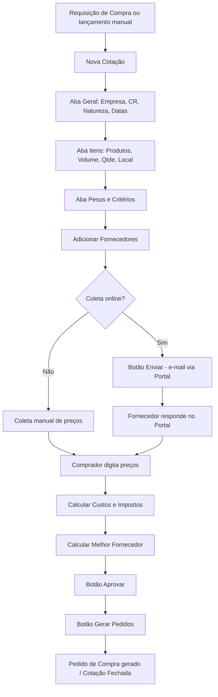

# Implantação do Módulo de Cotação — Sankhya Om

Guia de organização e implantação do módulo **Cotação** do ERP Sankhya, baseado na [documentação oficial](https://ajuda.sankhya.com.br/hc/pt-br/articles/360045113993-Cotação) e nos artigos relacionados.

> **Objetivo:** estruturar o processo de cotação de compras (do lançamento à geração do Pedido de Compra), incluindo o uso do **Portal de Cotação Online** para os fornecedores.

---

## Sumário

1. [Visão geral do processo](#1-visão-geral-do-processo)
2. [Pré-requisitos (cadastros básicos)](#2-pré-requisitos-cadastros-básicos)
3. [Parâmetros do sistema](#3-parâmetros-do-sistema)
4. [Configurações específicas da Cotação](#4-configurações-específicas-da-cotação)
5. [Portal de Cotação Online](#5-portal-de-cotação-online)
6. [Modo Cabeçalho vs. Modo Itens](#6-modo-cabeçalho-vs-modo-itens)
7. [Fluxo operacional (passo a passo)](#7-fluxo-operacional-passo-a-passo)
8. [Pesos e Critérios para melhor fornecedor](#8-pesos-e-critérios-para-melhor-fornecedor)
9. [Controle de acessos e Central de Certificações](#9-controle-de-acessos-e-central-de-certificações)
10. [Plano de implantação sugerido](#10-plano-de-implantação-sugerido)
11. [Checklist final / Go-Live](#11-checklist-final--go-live)
12. [Links úteis](#12-links-úteis)

---

## 1. Visão geral do processo

Cotação é o processo no qual o **comprador** solicita preços a vários **fornecedores** para um conjunto de produtos, avalia retornos por critérios (preço, prazo, qualidade, etc.) e gera o **Pedido de Compra** com o vencedor.

Situações que um item de cotação pode assumir:

| Situação | Quando ocorre |
|---|---|
| **Aberta** | Lançamento inicial ou cotação gerada a partir de requisição |
| **Enviada** | Todos os fornecedores Online já receberam o e-mail |
| **Precificada** | Atingiu o mínimo de respostas (param. `ALERTRESPMINCOT`) |
| **Aprovada** | Comprador aprovou um fornecedor |
| **Fechada** | Pedido de Compra gerado |
| **Cancelada** | Cancelada pelo comprador |

Tabelas envolvidas (referência técnica):
- `TGFCOT` — cabeçalho da cotação
- `TGFITC` — itens da cotação
- `TGFCOL` — coleta de preços (fornecedores x item)

---

## 2. Pré-requisitos (cadastros básicos)

Antes de habilitar a rotina, garanta:

- [ ] **Cadastro de Produtos** corretamente preenchido (`Unid. Compra` e `Unidade padrão` na aba Geral).
- [ ] **Cadastro de Parceiros / Fornecedores** com:
  - aba **Contatos** → marcação **"Envia notificações de cotação?"** no contato que receberá o e-mail.
  - **Contato padrão para cotação** (aba Geral) — opcional, mas recomendado.
  - aba **Moedas p/ Portal Cot.** (se for usar moeda estrangeira).
  - aba **Produtos Cotação** (se for usar sugestão de fornecedores por produto/grupo/classificação).
- [ ] **TOP (Tipo de Operação)** específico para o **Pedido de Compra** gerado pela cotação.
  - Se for usar múltiplas datas de entrega: marcar **"Exige previsão de entregas"** na aba Validações.
  - Campo **Precifica** = *"Atualiza custo e preço de venda"* se desejar atualizar preços via cotação.
- [ ] **Modelo de Nota** (referenciado nas Preferências da Cotação) para cálculo de impostos/custos.
- [ ] **Modelos de E-mail p/ Cotação** cadastrados (caso contrário usa o template padrão).
- [ ] **Servidor SMTP** configurado para envio dos e-mails.
- [ ] **Usuários compradores** marcados como tal no cadastro de usuário.

---

## 3. Parâmetros do sistema

Configure os parâmetros abaixo (tela **Preferências / Parâmetros do Sistema**):

| Parâmetro | Descrição | Recomendação |
|---|---|---|
| `USAMODCABCOT` | Utiliza Cotação no Modo Cabeçalho | **Ligado** (foco na cotação, não no item) |
| `ALERTRESPMINCOT` | Mínimo de respostas p/ sugestão de resultado | Ex.: `3` |
| `RESPCOTCOMPR` | Responsável pela cotação tem que ser comprador? | Ligado |
| `TRABMOECOT` | Trabalhar com moedas na cotação | Ligar somente se houver fornecedor estrangeiro |
| `INFMOTCANCOT` | Informar motivo de cancelamento | **Ligado** (rastreabilidade) |
| `COTDESAPPEDGER` | Permite desaprovar produto com pedido gerado | Desligado (default) |
| `CODPRODGENCOT` | Produto genérico que pode repetir | `0` (não permite) ou código específico |
| `DECVLRIMPUNTCOT` | Decimais p/ impostos unitários | `2` |

> Anote em planilha cada parâmetro: **valor atual × valor desejado × responsável × data**.

---

## 4. Configurações específicas da Cotação

Consultar artigo: [Configurações para Cotação](https://ajuda.sankhya.com.br/hc/pt-br/articles/360044602454).

Dentro da própria tela **Cotação → Outras Opções → Preferências**, habilitar conforme necessidade:

- [ ] **Calcular custos e preço**
- [ ] **Calcular ICMS, ST e IPI**
- [ ] **Exibir último valor unitário da compra**
- [ ] Definir o **Modelo de Nota** padrão usado no cálculo de custos/impostos.

Cadastros auxiliares:

- [ ] **Motivos de Cancelamento da Cotação** (se `INFMOTCANCOT` ligado).
- [ ] **Pesos e Critérios** padrão (preço, prazo, qualidade, atendimento, confiança, garantia).
- [ ] **Modelos de E-mail p/ Cotação** (assunto, corpo, variáveis).
- [ ] **Central de Certificações** (regras por Empresa/Natureza/CR/Projeto/Produto).

---

## 5. Portal de Cotação Online

Permite ao fornecedor responder a cotação via web sem login no ERP.

Configurações:

- [ ] Habilitar o **Portal de Cotação Online** (módulo B2B).
- [ ] Cadastrar o **contato como usuário B2B** no parceiro.
- [ ] Marcar **"Envia notificações de cotação?"** no contato.
- [ ] Configurar o **link do portal** no e-mail (variável do modelo).
- [ ] Em ambiente de teste no **mesmo servidor**: alertar usuários sobre perda de sessão (cookie compartilhado).

Documentação: [Portal de Cotação Online](https://ajuda.sankhya.com.br/hc/pt-br/articles/360045114073).

---

## 6. Modo Cabeçalho vs. Modo Itens

| Aspecto | Modo Itens (padrão) | Modo Cabeçalho (`USAMODCABCOT` ligado) |
|---|---|---|
| Foco da tela | Item de cotação | Cabeçalho da cotação |
| Botão **Duplicar** | Indisponível | Disponível (só cabeçalho `TGFCOT`) |
| Cancelamento de item | Direto | Via **Outras Opções → Cancelar Item** |
| Marcação **Precificada** no filtro | Disponível | Indisponível |
| Regras Central de Certif. | Itens (`CODLOCAL`, `CODPROD`) | Cabeçalho (`CODEMP`, `CODNAT`, `CODCENCUS`, `CODPROJ`) + itens |
| Portal de Cotação Online | Visão por item | Visão por cabeçalho |

**Recomendação:** definir o modo *antes do go-live* — trocar depois exige re-treinamento e pode causar perda de sessão no portal.

---

## 7. Fluxo operacional (passo a passo)



---

## 8. Pesos e Critérios para melhor fornecedor

Critérios disponíveis (peso 0–10 cada):

- **Preço** (padrão: peso 1, demais 0)
- **Prazo de entrega**
- **Prazo médio de pagamento**
- **Qualidade do produto**
- **Qualidade do atendimento**
- **Confiança no fornecedor**
- **Garantia**

Fórmula do **Custo Final** (campo calculado):

```
Custo final = valor orçado − desconto + acréscimos + IPI + Frete + ICMS + outros
```

Fórmula do **Total** por item:

```
Total = (Preço unit. + Acréscimo unit. + IPI unit. + ST unit. + Frete unit. + Outros − Desconto unit.) × Quantidade
```

Defina e **valide os pesos com a área de Compras** antes do go-live.

---

## 9. Controle de acessos e Central de Certificações

- Permissão de **Alterar** é obrigatória para: **Enviar, Aprovar, Gerar Pedidos, Cancelar**. Apenas **Consultar** desabilita esses botões.
- Use a **Central de Certificações** para restringir cotações por:
  - **Modo Cabeçalho**: Empresa, Natureza, Centro de Resultado, Projeto.
  - **Modo Itens**: Local, Grupo de Produtos, Produto.
- Regras podem ser **gerais** ou **por usuário**.

---

## 10. Plano de implantação sugerido

### Fase 1 — Levantamento (semana 1)
- Mapear processo atual de compras (As-Is).
- Listar fornecedores ativos e contatos de cotação.
- Definir critérios e pesos com a área de Compras.
- Definir modo: Cabeçalho ou Itens.

### Fase 2 — Configuração em ambiente de homologação (semana 2)
- Ajustar parâmetros da seção 3.
- Atualizar cadastros (Produtos, Parceiros, Contatos, TOPs, Modelos de Nota).
- Cadastrar Pesos e Critérios, Motivos de Cancelamento, Modelos de E-mail.
- Configurar Portal de Cotação Online.
- Aplicar regras na Central de Certificações.

### Fase 3 — Testes (semana 3)
- Caso 1: cotação manual com 3 fornecedores → aprovar → gerar pedido.
- Caso 2: cotação online → e-mail enviado → fornecedor responde no portal.
- Caso 3: cotação com moeda estrangeira (se aplicável).
- Caso 4: cancelamento com motivo obrigatório.
- Caso 5: múltiplas datas de entrega + provisão no Portal de Compras.
- Caso 6: cálculo de melhor fornecedor com pesos personalizados.

### Fase 4 — Treinamento (semana 4)
- Compradores: lançamento, envio, aprovação, geração de pedido.
- Fornecedores piloto: acesso e resposta no portal.
- Material: roteiros + vídeo curto + FAQ.

### Fase 5 — Go-Live e estabilização (semana 5+)
- Migração de cotações em aberto (se houver).
- Acompanhamento diário na 1ª semana, semanal no 1º mês.
- Coleta de melhorias e ajustes finos de parâmetros/pesos.

---

## 11. Checklist final / Go-Live

- [ ] Parâmetros configurados e validados em PROD.
- [ ] Pelo menos 1 fornecedor piloto testado no Portal Online.
- [ ] E-mail de cotação chegando corretamente (SMTP OK).
- [ ] TOP de Pedido de Compra testada (com e sem múltiplas datas).
- [ ] Modelo de Nota validado no cálculo de custos/impostos.
- [ ] Pesos e Critérios aprovados pela área de Compras.
- [ ] Permissões de acesso revisadas por perfil.
- [ ] Regras da Central de Certificações ativas.
- [ ] Motivos de cancelamento cadastrados.
- [ ] Treinamento concluído (compradores e fornecedores piloto).
- [ ] Plano de rollback documentado.

---

## 12. Links úteis

- [Cotação — visão geral](https://ajuda.sankhya.com.br/hc/pt-br/articles/360045113993-Cotação)
- [Configurações para Cotação](https://ajuda.sankhya.com.br/hc/pt-br/articles/360044602454)
- [Cotação — Parâmetros utilizados](https://ajuda.sankhya.com.br/hc/pt-br/articles/360044597054)
- [Cotação — Botão Outras Opções](https://ajuda.sankhya.com.br/hc/pt-br/articles/360044602254)
- [Cotação — Gerar Pedidos](https://ajuda.sankhya.com.br/hc/pt-br/articles/360044597114)
- [Portal de Cotação Online](https://ajuda.sankhya.com.br/hc/pt-br/articles/360045114073)
- [Modelos de E-mail p/ Cotação](https://ajuda.sankhya.com.br/hc/pt-br/articles/360044600154)
- [Motivos de Cancelamento da Cotação](https://ajuda.sankhya.com.br/hc/pt-br/articles/4414180005783)
- [Tipos de Operação — TOP](https://ajuda.sankhya.com.br/hc/pt-br/articles/360044603114)
- [Cadastro de Parceiros](https://ajuda.sankhya.com.br/hc/pt-br/articles/360044594494)
- [Cadastro de Produtos](https://ajuda.sankhya.com.br/hc/pt-br/articles/360045112113)
- [Central de Certificações](https://ajuda.sankhya.com.br/hc/pt-br/articles/360045110053)
