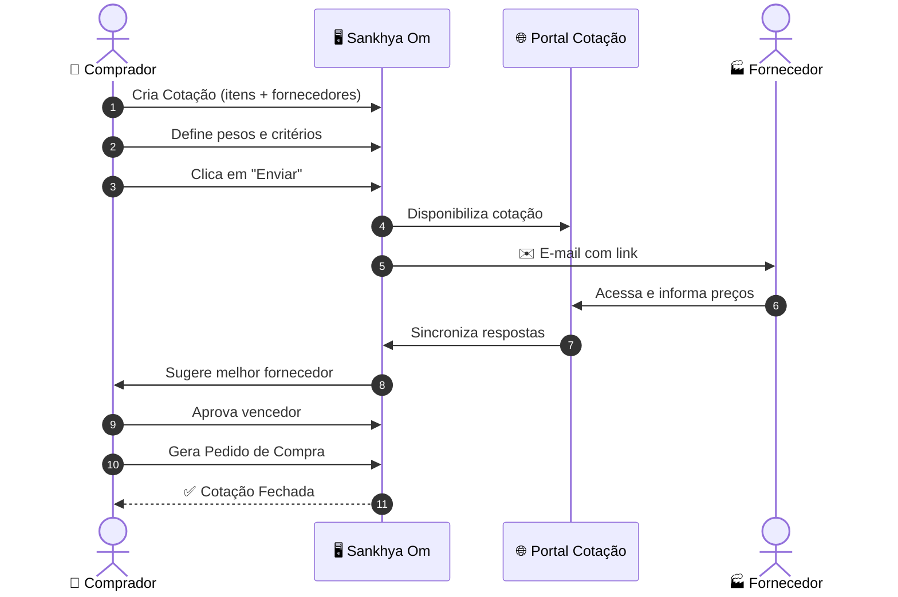

# 📋 Índice de Implantação — Módulo Cotação Sankhya

> **Acompanhamento visual das etapas.** Marque `[x]` conforme avançar.
> Documentos relacionados: [README.md](README.md) · [parametros.md](parametros.md)

---

## 🗺️ Mapa geral

```mermaid
flowchart LR
    F1([🔍 1. Levantamento]) --> F2([⚙️ 2. Configuração])
    F2 --> F3([🧪 3. Testes])
    F3 --> F4([🎓 4. Treinamento])
    F4 --> F5([🚀 5. Go-Live])
    F5 --> F6([📈 6. Pós Go-Live])

    style F1 fill:#FEF3C7,stroke:#D97706,color:#000
    style F2 fill:#DBEAFE,stroke:#2563EB,color:#000
    style F3 fill:#FCE7F3,stroke:#DB2777,color:#000
    style F4 fill:#E0E7FF,stroke:#4F46E5,color:#000
    style F5 fill:#D1FAE5,stroke:#059669,color:#000
    style F6 fill:#F3E8FF,stroke:#7C3AED,color:#000
```

---

## 📊 Progresso geral

| Fase | Status | Progresso |
|---|---|---|
| 🔍 1. Levantamento | ⬜ Não iniciado | `░░░░░░░░░░` 0% |
| ⚙️ 2. Configuração | ⬜ Não iniciado | `░░░░░░░░░░` 0% |
| 🧪 3. Testes | ⬜ Não iniciado | `░░░░░░░░░░` 0% |
| 🎓 4. Treinamento | ⬜ Não iniciado | `░░░░░░░░░░` 0% |
| 🚀 5. Go-Live | ⬜ Não iniciado | `░░░░░░░░░░` 0% |
| 📈 6. Pós Go-Live | ⬜ Não iniciado | `░░░░░░░░░░` 0% |

> **Legenda:** ⬜ Não iniciado · 🟡 Em andamento · ✅ Concluído · ⛔ Bloqueado

---

## 🔍 Fase 1 — Levantamento

> 🎯 **Objetivo:** entender o processo atual e definir o desenho da solução.

- [ ] 📌 Mapear processo **As-Is** de compras
- [ ] 📌 Listar **fornecedores ativos** e seus contatos
- [ ] 📌 Levantar **categorias de produtos** mais cotados
- [ ] 📌 Definir **modo de operação**: 🏷️ Cabeçalho ✅ ou 📦 Itens
- [ ] 📌 Definir **critérios e pesos** (preço, prazo, qualidade, atendimento, confiança, garantia)
- [ ] 📌 Identificar **usuários compradores** que terão acesso
- [ ] 📌 Definir **KPIs** de sucesso (ex.: % cotações via portal, economia média)

📎 _Entregáveis: documento As-Is + matriz de critérios + lista de fornecedores piloto_

---

## ⚙️ Fase 2 — Configuração (Homologação)

> 🎯 **Objetivo:** deixar o ambiente pronto para testes.

### 2.1. 🔧 Parâmetros do sistema → [parametros.md](parametros.md)

- [ ] `USAMODCABCOT` — Modo Cabeçalho
- [ ] `ALERTRESPMINCOT` — Mínimo de respostas
- [ ] `RESPCOTCOMPR` — Responsável = comprador
- [ ] `TRABMOECOT` — Moedas (se aplicável)
- [ ] `INFMOTCANCOT` — Motivo de cancelamento
- [ ] `COTDESAPPEDGER` — Desaprovar com pedido
- [ ] `CODPRODGENCOT` — Produto repetido
- [ ] `DECVLRIMPUNTCOT` — Decimais de impostos

### 2.2. 📇 Cadastros básicos

- [ ] 📦 **Produtos**: `Unid. Compra` e `Unidade padrão` preenchidos
- [ ] 🤝 **Parceiros / Fornecedores**:
  - [ ] Contato com **"Envia notificações de cotação?"** ✉️
  - [ ] **Contato padrão para cotação** (aba Geral)
  - [ ] Aba **Moedas p/ Portal Cot.** (se moeda estrangeira)
  - [ ] Aba **Produtos Cotação** (sugestão automática)
- [ ] 🧾 **TOP** específica para Pedido de Compra gerado
  - [ ] Marcação **"Exige previsão de entregas"** (se múltiplas datas)
  - [ ] Campo **Precifica** = *"Atualiza custo e preço de venda"*
- [ ] 📄 **Modelo de Nota** padrão para cálculo de custos/impostos
- [ ] ✉️ **Modelos de E-mail p/ Cotação** (assunto, corpo, variáveis)
- [ ] 📨 **Servidor SMTP** configurado e testado
- [ ] 👤 **Usuários compradores** marcados como tal

### 2.3. ⭐ Preferências da Cotação (Outras Opções)

- [ ] Calcular custos e preço
- [ ] Calcular ICMS, ST e IPI
- [ ] Exibir último valor unitário da compra
- [ ] Modelo de Nota vinculado

### 2.4. 🗂️ Cadastros auxiliares

- [ ] ❌ **Motivos de Cancelamento** (se `INFMOTCANCOT` ligado)
- [ ] ⚖️ **Pesos e Critérios** padrão
- [ ] 🛡️ **Central de Certificações** (regras por Empresa/CR/Projeto/Produto)

### 2.5. 🌐 Portal de Cotação Online

- [ ] Módulo B2B habilitado
- [ ] Contatos cadastrados como **usuário B2B**
- [ ] Marcação **"Envia notificações de cotação?"** validada
- [ ] **Link do portal** configurado no modelo de e-mail
- [ ] Teste de acesso por fornecedor piloto

---

## 🧪 Fase 3 — Testes (Homologação)

> 🎯 **Objetivo:** validar todos os fluxos antes de levar para produção.

| # | Cenário | Status |
|---|---|---|
| 1 | 🟢 Cotação **manual** com 3 fornecedores → aprovar → gerar pedido | ⬜ |
| 2 | 🌐 Cotação **online** → e-mail enviado → resposta no portal | ⬜ |
| 3 | 💱 Cotação com **moeda estrangeira** (se aplicável) | ⬜ |
| 4 | ❌ **Cancelamento** com motivo obrigatório | ⬜ |
| 5 | 📅 **Múltiplas datas de entrega** + provisão no Portal de Compras | ⬜ |
| 6 | ⚖️ Cálculo de **melhor fornecedor** com pesos personalizados | ⬜ |
| 7 | 🧮 **Calcular custos e impostos** (botão) | ⬜ |
| 8 | 🔁 **Reenvio** de e-mail para fila | ⬜ |
| 9 | 🛡️ **Permissões**: usuário só "Consultar" não envia/aprova | ⬜ |
| 10 | 🏷️ **Regras** da Central de Certificações ativas | ⬜ |

📎 _Entregável: planilha de evidências (prints + observações por cenário)_

---

## 🎓 Fase 4 — Treinamento

> 🎯 **Objetivo:** capacitar usuários internos e fornecedores piloto.

- [ ] 👥 Treinamento de **compradores** (lançamento → aprovação → geração)
- [ ] 🤝 Treinamento de **fornecedores piloto** (portal)
- [ ] 📘 Roteiro / manual passo a passo
- [ ] 🎥 Vídeo curto (3–5 min) demonstrando o fluxo
- [ ] ❓ FAQ inicial publicado
- [ ] 📞 Canal de suporte definido (quem atende, horário)

---

## 🚀 Fase 5 — Go-Live

> 🎯 **Objetivo:** subir para produção com segurança.

### ✅ Checklist final

- [ ] ⚙️ Parâmetros aplicados em **PROD**
- [ ] 🌐 Fornecedor piloto testado no Portal Online em PROD
- [ ] ✉️ E-mail de cotação chegando (SMTP OK)
- [ ] 🧾 TOP de Pedido de Compra testada
- [ ] 📄 Modelo de Nota validado em cálculos
- [ ] ⚖️ Pesos e Critérios aprovados por Compras
- [ ] 🔐 Permissões revisadas por perfil
- [ ] 🛡️ Regras da Central de Certificações ativas
- [ ] ❌ Motivos de cancelamento cadastrados
- [ ] 🎓 Treinamento concluído
- [ ] 🔄 **Plano de rollback** documentado
- [ ] 📣 **Comunicado oficial** enviado a usuários e fornecedores

### 🗓️ Janela de Go-Live

| Item | Definição |
|---|---|
| Data prevista | `____/____/____` |
| Horário | `__:__` |
| Responsável | `____________________` |
| Backup confirmado | ⬜ |
| Stakeholders avisados | ⬜ |

---

## 📈 Fase 6 — Pós Go-Live

> 🎯 **Objetivo:** estabilizar, medir e melhorar.

- [ ] 📊 Acompanhamento **diário** na 1ª semana
- [ ] 📊 Acompanhamento **semanal** no 1º mês
- [ ] 🐛 Registro de **incidentes / dúvidas** em planilha
- [ ] 🔄 Ajuste fino de **parâmetros e pesos**
- [ ] 📈 Apuração dos **KPIs** (economia, tempo médio, % portal)
- [ ] 🆕 Expansão para **demais fornecedores**
- [ ] 📝 **Retrospectiva** do projeto (lições aprendidas)

---

## 🔁 Ciclo operacional (referência rápida)

---

## 🧭 Atalhos

| Documento | Descrição |
|---|---|
| 📘 [README.md](README.md) | Guia completo de implantação |
| 📊 [parametros.md](parametros.md) | Planilha de controle de parâmetros |
| 🔗 [Doc. oficial Sankhya](https://ajuda.sankhya.com.br/hc/pt-br/articles/360045113993-Cotação) | Manual da rotina Cotação |

---

> 💡 **Dica:** atualize este arquivo ao final de cada dia/semana. Ele é seu *painel de bordo* do projeto.
